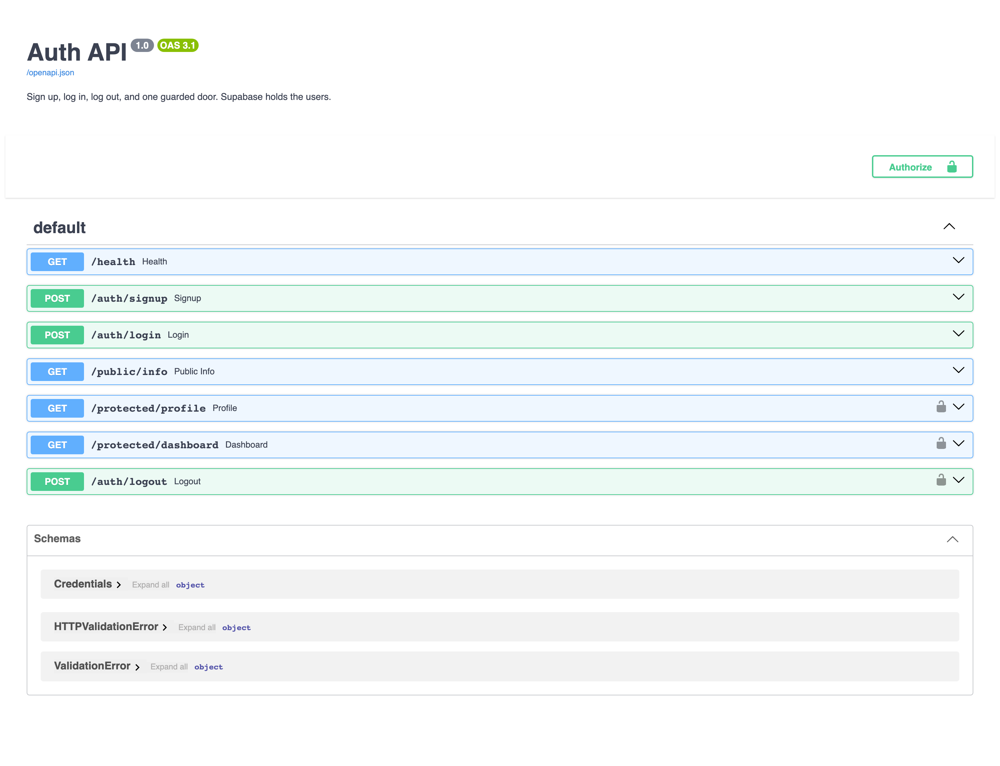
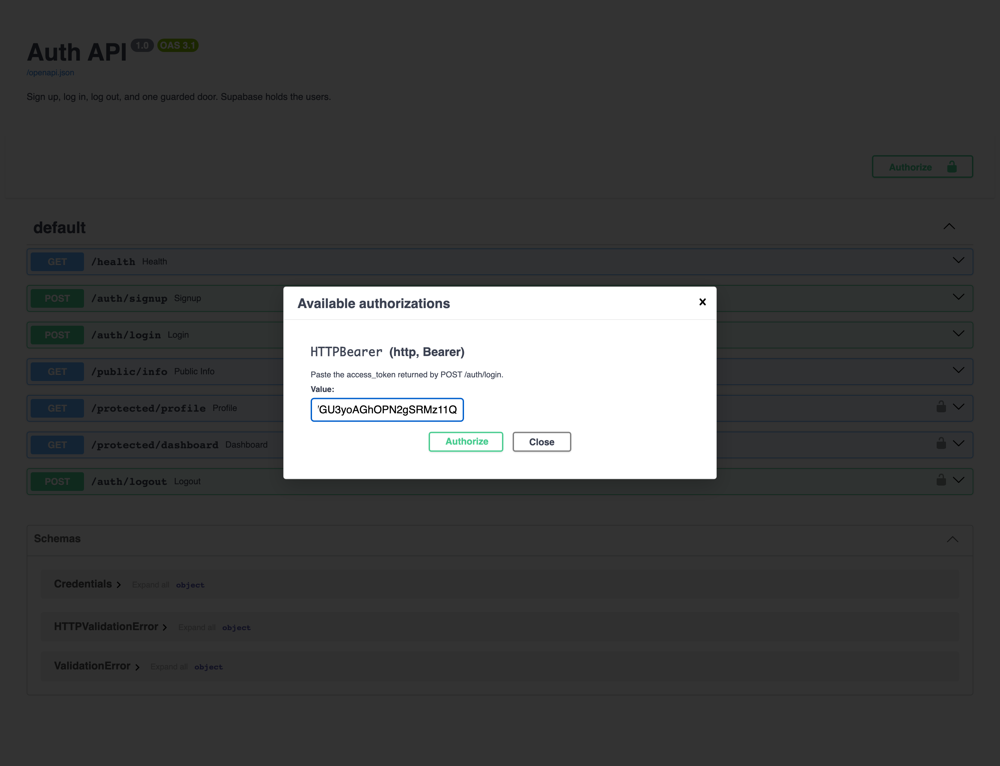
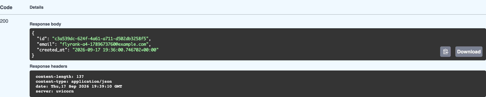

# Auth: login and protect (FlyRank A4)

A secure API where Supabase holds the users and this server only ever checks the tokens it
hands out. Sign up, log in, log out, and doors that stay shut without a valid pass.



## The trust triangle

Nobody trusts a password sitting on an application server, so there is not one here. The client
sends credentials to Supabase, Supabase signs a JWT, the client attaches that token to requests,
and this server asks Supabase whether the token is real.

| Step | Who | What happens |
| --- | --- | --- |
| 1 | client to Supabase | email and password go to the identity provider |
| 2 | Supabase to client | a signed access token comes back |
| 3 | client to this API | the token rides in `Authorization: Bearer <token>` |
| 4 | this API to Supabase | "is this token real?" If yes, the door opens |

The rule that follows from it, and the one this whole folder obeys: **no password is stored here
and nothing is hashed here.** `test_auth.py` asserts that `bcrypt`, `hashlib`, `passlib` and
`sha256` appear nowhere in `main.py`, because the moment one of them does, this server has taken
on a responsibility it was designed not to have.

## Run it

Python 3.11. From this `auth/` folder:

```bash
python3.11 -m venv .venv
.venv/bin/pip install -r requirements.txt
cp .env.example .env          # then fill in the two Supabase values
.venv/bin/uvicorn main:app --port 8000
```

Then open http://localhost:8000/docs. The tests need no network:

```bash
.venv/bin/python test_auth.py
```

### The environment variables

`.env` is git-ignored and was never committed. `.env.example` is committed with the names and no
values.

| Variable | Where it comes from |
| --- | --- |
| `SUPABASE_URL` | Dashboard, Project Settings, API, "Project URL" |
| `SUPABASE_KEY` | The same page, the **anon** / **publishable** key |
| `PORT` | 8000 |
| `ADMIN_EMAILS` | comma separated, for the 403 route below |

Use the anon key, never `service_role`. The service role key bypasses every rule in the project,
and handing it to an application server is the opposite of what this assignment is about. The
server refuses to start if either value is missing or still a placeholder, with a message saying
where to get the real one, because a boot-time failure is cheaper than a confusing 500 later.

Two project settings have to be right, and both live in Authentication, Sign In / Providers,
Email: the **Email provider must be enabled**, and **Confirm email must be off**. With the
provider off, signup returns `400 Email signups are disabled`. With confirmation on, every new
account is stuck unconfirmed and can never log in. Supabase will tell you its own state:

```bash
curl -s "$SUPABASE_URL/auth/v1/settings" -H "apikey: $SUPABASE_KEY"
# external.email must be true, mailer_autoconfirm must be true
```

In production you would leave email confirmation on. It is a real security feature and this is a
practice project.

## The endpoints

| Route | Purpose | Auth |
| --- | --- | --- |
| `POST /auth/signup` | create an account | none |
| `POST /auth/login` | exchange credentials for a JWT | none |
| `POST /auth/refresh` | exchange a refresh token for a new JWT | none |
| `POST /auth/logout` | end the session | `Bearer <token>` |
| `GET /public/info` | public data | none |
| `GET /protected/profile` | the caller's own profile | `Bearer <token>` |
| `GET /protected/dashboard` | a second guarded route | `Bearer <token>` |
| `GET /protected/admin` | admins only | `Bearer <token>`, and 403 otherwise |
| `GET /health` | liveness | none |

## Proof

Signing up and logging in:

```
$ curl -i -X POST http://localhost:8000/auth/signup \
    -H "Content-Type: application/json" \
    -d '{"email":"flyrank-a4-1789673760@example.com","password":"password123"}'
HTTP/1.1 201 Created
{"id":"c3a539dc-624f-4a61-a711-d502db3258f5",
 "email":"flyrank-a4-1789673760@example.com",
 "created_at":"2026-09-17 19:36:00.746702+00:00"}

$ curl -X POST http://localhost:8000/auth/login ...
status=200
access_token: eyJhbGciOiJFUzI1NiIsImtpZCI6ImQ1MzgwMzE2... (966 chars)
refresh_token present: True | expires_in: 3600
```

Bad input never reaches Supabase, and a wrong password says as little as possible:

```
$ curl -X POST .../auth/signup -d '{"email":"x@y.com"}'
{"error":"password: Field required"}        [400]

$ curl -X POST .../auth/login -d '{"email":"...","password":"wrong-password"}'
{"error":"Invalid login credentials"}       [401]
```

That 401 message is deliberately the same whether the email exists or not. Telling a caller
"no such user" versus "wrong password" hands them a way to find out which addresses are
registered.

## Watching a forged pass get rejected

```
signature byte flipped   -> 401 {"error":"Invalid or expired token"}
payload byte flipped     -> 401 {"error":"Invalid or expired token"}
entirely forged token    -> 401 {"error":"Invalid or expired token"}
valid token              -> 200
```

**The mistake I made getting there.** The brief says to change one character of the token and
watch it fail. I changed the last one and got `200`, which looked like a hole in the guard.
It was not. The signature is 86 base64 characters encoding 64 bytes, so the final character
carries only two significant bits, and the `Q` I replaced with `X` shares both of them:

```
signature bytes identical after changing the last char: True
```

The token had not been altered at all. Flipping a character in the middle of the signature or
the payload produces a genuinely different token, and that is refused. Worth writing down
because the first result looked like a security failure and was a measurement failure, and the
difference between those two is the whole job.

## One guard, every door

The token check lives in a single `current_user` dependency. Adding `GET /protected/dashboard`
took no new auth code at all, which is the point of the stage:

```
/protected/dashboard, valid token   -> 200
/protected/dashboard, bad token     -> 401
/protected/dashboard, no token      -> 401
```

Copy-pasting the check into each route is how a door ends up unguarded: miss one and nothing
tells you. Declaring it once as `HTTPBearer` also gives Swagger the padlock for free, so stage 5
was mostly already done by the time I got to it.

## Swagger, driven for real

Not a description of clicking Authorize. The browser was actually driven, headlessly: click
Authorize, paste the token from `/auth/login`, Try it out on `GET /protected/profile`, Execute.





`200`, the user's own record, no curl involved. The OpenAPI document backs it up: `HTTPBearer`
with `scheme: bearer` and `bearerFormat: JWT`, applied to exactly the four protected routes and
none of the public ones, which `test_auth.py` asserts route by route.

## Extras

### 401 and 403 are different answers

```
/protected/admin, no token          -> 401  {"error":"Access token required"}
/protected/admin, valid non-admin   -> 403  {"error":"This route is for admins only"}
```

401 means "I do not know you". 403 means "I know exactly who you are, and no". Reaching the 403
at all proves the token was valid, so the refusal is about authorisation rather than
authentication. `ADMIN_EMAILS` is a constant here, which a real system would replace with a claim
on the token or a role on the user record, because a list in an environment variable does not
survive contact with more than a handful of admins.

### Reading the token yourself

```
header : {"alg": "ES256", "kid": "d5380316-...", "typ": "JWT"}
claims : aal, amr, app_metadata, aud, email, exp, iat, is_anonymous, iss, phone,
         role, session_id, sub, user_metadata
sub    : c3a539dc-624f-4a61-a711-d502db3258f5
email  : flyrank-a4-1789673760@example.com
role   : authenticated
```

Two things that follow. First, a JWT is **signed, not encrypted**: those claims came out with
base64 and no key whatsoever, so anyone holding the token can read every one of them. Never put
anything in a token you would not print on a postcard. Second, the signature is the only part
that matters for trust, and it is the one part you cannot read anything out of: it is checked,
not decoded, and checking it is what Supabase does when this server asks.

### The refresh flow

```
POST /auth/refresh with the refresh token   -> 200
new access_token differs from the old one   -> True
the new token works on /protected/profile   -> 200
a rubbish refresh token                     -> 401
```

Access tokens last an hour on purpose. Something has to renew them that is not the user typing
their password every hour, and that is what the refresh token is.

### A real logout test, and what it exposes

```
POST /auth/logout with a valid token        -> 204
the same token on /protected/profile after  -> 200
```

The token still works after logging out. That is not a bug in the route, it is what "stateless"
means: the JWT was signed an hour ago with an `exp` an hour ahead, and nothing about calling
logout reaches into a token already sitting in somebody's browser.

```
issued  19:36:00 UTC
expires 20:36:00 UTC  (lifetime 60 minutes)
```

This is why instant logout is genuinely hard and why real systems reach for short token
lifetimes, a revocation list the guard checks, or session-backed tokens instead. Each of those
buys back the immediacy by giving up some of the statelessness that made JWTs attractive.

### Not done

The expiry experiment. It needs an hour of waiting for a token to age out, and I could confirm
from the `exp` claim that the lifetime is 60 minutes but could not sit through it, so the
observed `401` from a genuinely expired token is the one box in this README I have not ticked
myself.

## The tests

`test_auth.py` is 37 plain asserts and needs no network for most of them. It covers the absence
of any hashing library, the 400s for every malformed body, the public route, every protected
route unauthenticated, five shapes of malformed `Authorization` header, a forged token, and the
OpenAPI security declarations route by route.

## An honest limitation

`supabase.auth.sign_out()` acts on the client object this server holds, not on the specific token
in the request, because one shared anon client serves every caller. With stateless JWTs the
practical effect is the same, which is to say very little, as the logout experiment above shows.
A version that mattered would track sessions server side and have the guard check them.
