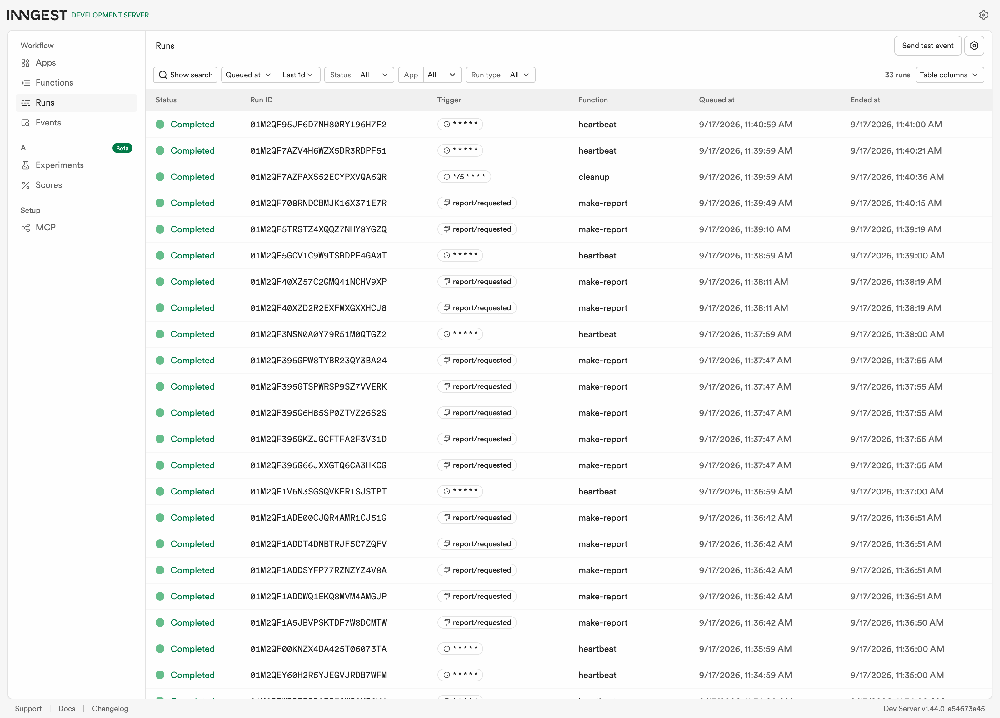
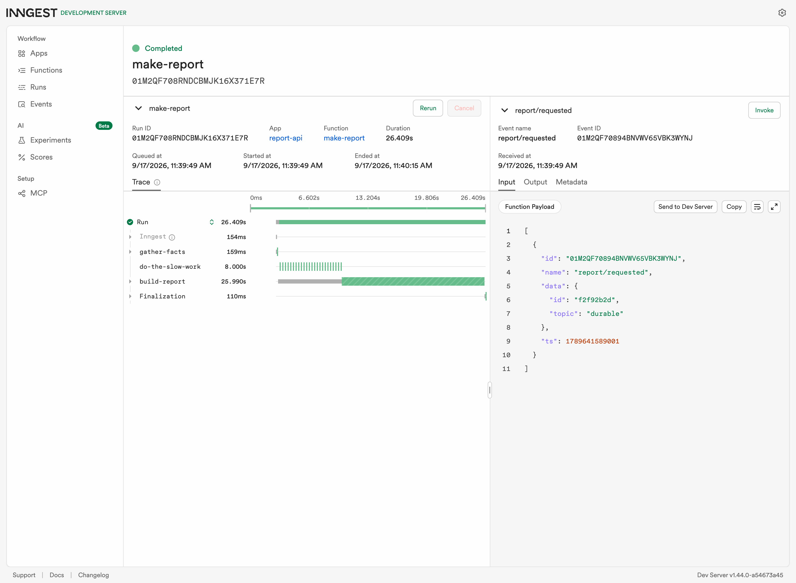

# Your first background job (FlyRank A7)

An API that takes a report request, answers in under two milliseconds, and builds the report in
a worker process where nobody is waiting on it. Building a report takes about eight seconds.
The client never waits eight seconds.

## Run it

Python 3.11, and two terminals. From this `background-job/` folder:

```bash
# terminal 1, the API
python3.11 -m venv .venv
.venv/bin/pip install -r requirements.txt
.venv/bin/uvicorn main:app --port 8000
```

```bash
# terminal 2, the Inngest Dev Server
npx inngest-cli@latest dev -u http://localhost:8000/api/inngest
```

Then open the dashboard at http://localhost:8288. The tests need neither terminal:

```bash
.venv/bin/python test_jobs.py
```

## The doors and the workers

| Endpoint | Does | Answers |
| --- | --- | --- |
| `GET /health` | liveness | `200` `{"status": "ok"}` |
| `POST /reports` | takes the order, sends an event, does no slow work | `202` + `{"id", "status": "pending"}`, or `400` if the topic is missing or blank |
| `GET /reports/{id}` | where that report got to | the report, or `404` |
| `GET /reports` | every report and its status | `200` + a count and a list |
| `POST /api/inngest` | where the Dev Server talks to the functions | served by the SDK |

| Function | Triggered by | Does |
| --- | --- | --- |
| `say-hello` | event `test/hello` | sleeps 5 seconds, proves work happens elsewhere |
| `make-report` | event `report/requested` | three steps: gather, sleep 8s, build and save |
| `heartbeat` | cron `* * * * *` | logs one line counting pending, done and failed |
| `cleanup` | cron `*/5 * * * *` | forgets done reports older than ten minutes |

## Proof: fast answer, slow work

```
$ curl -o /dev/null -s -w 'status=%{http_code}  total=%{time_total}s\n' \
    -X POST http://localhost:8000/reports \
    -H "Content-Type: application/json" -d '{"topic":"cats"}'
status=202  total=0.001845s

$ curl -s http://localhost:8000/reports/d1e99078
{"id":"d1e99078","topic":"cats","status":"pending"}

# eleven seconds later
$ curl -s http://localhost:8000/reports/d1e99078
{"id":"d1e99078","topic":"cats","status":"done",
 "result":"Everything worth knowing about cats, from 3 sources.",
 "finished_at":"2026-09-17T10:42:08.427051+00:00"}
```

The request took 1.8 milliseconds. The work took eight seconds. Asking again and again until
the answer changes is called polling, and "pending now, done shortly" is eventual consistency.

## Bad input against a bad moment

A wrong input and a wrong moment are different failures and deserve different answers. A
request with no topic is wrong in a way that will still be wrong in four seconds, so it is
rejected at the door with a 400 and no job is ever created. A request that failed because the
oven broke might work on the next try, so it is retried with a growing wait between attempts.
Retrying bad input only burns the same error three times.

Posting `{"topic":"fail"}` makes the build step raise on purpose. With `retries=2` the run makes
three attempts and then gives up:

```
run status: FAILED  total: 67.7 s

attempt   started     ended       took
0         10:26:09    10:26:17       8s  FAILED
1         10:26:17    10:26:35      18s  FAILED
2         10:26:35    10:27:16      42s  FAILED
```

The waits grow: 8 seconds, then 18, then 42. That growth is backoff. An `on_failure` handler
then marks the report `failed`, so a dead job stops looking pending forever.

Meanwhile `curl -X POST .../reports -d '{}'` answers `400 {"error":"topic: Field required"}`
and creates no run at all.

## Reading a cron expression

Five fields, left to right: minute, hour, day of month, month, day of week. A `*` means every.

The heartbeat here runs `* * * * *`, every minute, which is a testing schedule and nothing else.
To run it **every day at 08:00** the expression is `0 8 * * *`: at minute 0 of hour 8, every day
of every month. To run it **every Sunday at 22:00** it is `0 22 * * 0`: at minute 0 of hour 22,
only on day-of-week 0, which is Sunday.

Both were built on crontab.guru rather than decoded by hand. Servers usually run cron in UTC, so
a schedule that looks like 08:00 to you may not be 08:00 where it runs.

Four consecutive heartbeats, nobody asking for any of them:

```
10:32:00  COMPLETED  "heartbeat: 0 reports, 0 pending, 0 done, 0 failed"
10:32:59  COMPLETED  "heartbeat: 2 reports, 1 pending, 1 done, 0 failed"
10:34:00  COMPLETED  "heartbeat: 2 reports, 0 pending, 1 done, 1 failed"
10:34:59  COMPLETED  "heartbeat: 2 reports, 0 pending, 1 done, 1 failed"
```

## The dashboard



All the functions in one list: `say-hello` completed, `make-report` completed several times, one
`make-report` failed after its retries, its `make-report (failure)` handler, and `heartbeat`
firing on the clock.

## The job outlived the server

The extras suggest stopping the API mid-job. Doing it with a three-step function shows something
sharper: which steps re-ran afterwards, and which did not.

Posted at 10:39:49. Killed the API at 10:39:52, three seconds in, while the eight-second sleep
was running. Brought it back at 10:40:10.

| Step | Started | Ended | Attempts |
| --- | --- | --- | --- |
| `gather-facts` | 10:39:49 | 10:39:49 | 0 |
| `do-the-slow-work` | 10:39:49 | 10:39:57 | 0 |
| `build-report` | 10:39:57 | 10:40:15 | 1 |

`gather-facts` finished three seconds before the process died and never ran again. The sleep
carried on across the outage, because it was being counted by the Dev Server and not by the
dead process. `build-report` came due at 10:39:57 while the API was still down, failed to
reach it, retried, and succeeded at 10:40:15, five seconds after it came back.



The report was `done` at 10:40:15 even though the process that accepted it no longer existed.
That property is durability, and it is the reason to reach for a job tool rather than a thread.

One honest detail: the `pending` entry that `POST` wrote into the in-memory dictionary **was**
lost in the restart. The report exists afterwards only because the job re-created it when it
finished. The job survived. The dictionary did not, which is exactly what an in-memory store
promises.

## Extras and stretch goals

**A list endpoint.** `GET /reports` returns every report and its status.

**The outbox.** When a report finishes, the job also writes `outbox/<id>.txt`. Writing a file
from a job is the same shape as sending an email from one, without needing a mail server.

**A cleanup cron.** A second scheduled function on `*/5 * * * *` forgets done reports older than
ten minutes. Taking out the rubbish is what most real cron jobs actually do. Failed reports are
kept, because those are the ones somebody will want to look at.

**Idempotency.** `build-report` returns the existing report if it is already done, so the same
event delivered twice builds one report. Proved by sending `report/requested` a third time with
the same id after the report had finished: `finished_at` stayed `10:38:19.683558` and the outbox
file's timestamp did not move. Jobs must survive running twice because at-least-once delivery is
the normal guarantee, and the alternative is billing a customer or emailing them twice.

A caveat found while testing it: when the two identical events arrive at the same instant, both
runs read `status: "pending"` before either writes, so both build. The result still ends up
correct here because both write the same dictionary key and the same file, but the check guards
against redelivery, not against a simultaneous double. A real system would need the database to
enforce that with a unique constraint.

**Concurrency cap: configured, and not proved locally.** `make-report` is configured with
`concurrency=[inngest.Concurrency(limit=2)]`, and the Dev Server confirms it registered:

```
config concurrency: [{"limit": 2, "scope": "Fn", "hash": ""}]
```

But queueing five reports and sampling the dashboard every two seconds shows the limit is not
being applied locally:

```
 t   RUNNING  COMPLETED
  0s        0          0
  2s        5          0
  4s        5          0
  6s        5          0
  8s        5          0
 10s        0          5

peak simultaneous RUNNING: 5
expected with a cap of 2: never above 2
```

All five ran at once and all five finished together after about eight seconds. With a cap of two
they should have finished in three waves over roughly 24 seconds. The configuration is right and
the local Dev Server does not enforce it, so this box is **configured but unverified**, and I am
not going to claim I watched three of them wait when I watched the opposite.

When would you want a queue to be slow? When the thing at the other end has a limit you do not
control: a rate-limited API, a database that falls over past a certain number of writers, or a
paid service billed per call. A cap turns someone else's outage into your queue.

## The tests

`test_jobs.py` is 15 plain asserts and needs no Dev Server, because everything it covers is
reachable without one: the 400s for a missing, blank or wrongly typed topic, the 404 for an
unknown id, the heartbeat's counting, and the cleanup rule about which reports expire.

The job functions themselves are not unit tested. Their behaviour is the retry timing, the
durability across a restart and the cron schedule, and none of those are things a mock would
tell you the truth about. They are checked above against a running Dev Server instead.

## An honest limitation

Reports live in a Python dictionary. Two workers would not see each other's reports, and a
restart forgets every pending one. The fix is the Postgres from A3, which this assignment did
not ask for.
