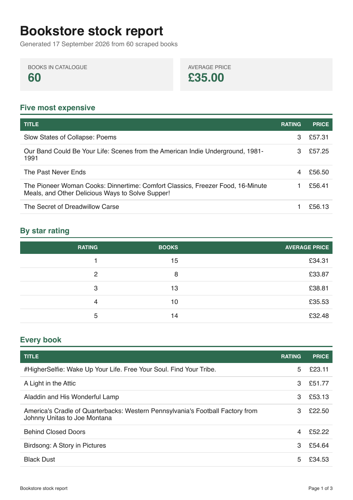

# PDF report generator (FlyRank A8)

Turns rows in a SQLite table into a printable A4 document: query, render a web page, and ask a
headless browser to print it. The API generates the report, records it, and serves the file by
link.



## The dataset: option B, the bookstore

This uses the 60 validated books my A9 scraper collected from books.toscrape.com, rather than
inventing 200 random orders. `seed.py` reads [`../scraper/output/books.json`](../scraper/output/books.json)
and loads it into `report.db`, converting the star rating from the word the site publishes
("Three") into a number the report can group and sort on (3).

## Run it

Python 3.11. From this `pdf-report-generator/` folder:

```bash
python3.11 -m venv .venv
.venv/bin/pip install -r requirements.txt
.venv/bin/playwright install chromium

.venv/bin/python seed.py                          # fills report.db with the 60 books
.venv/bin/uvicorn main:app --port 8100            # the API
```

Then `curl -X POST http://localhost:8100/reports`. The tests need no server and no browser:

```bash
.venv/bin/python test_report.py
```

Running `seed.py` twice leaves 60 rows rather than 120, because it clears the table before
inserting. `report.db` and `reports/` are both git-ignored: generated artefacts do not belong in
git, and the seed script is their recipe.

## Endpoints

| Endpoint | Does | Answers |
| --- | --- | --- |
| `GET /health` | liveness | `200 {"status": "ok"}` |
| `POST /reports` | runs the whole pipeline and records the file | `201` + `{"id", "file"}`, or `200` with the existing id if today already has one |
| `GET /reports` | every report generated, newest first | `200` + a count and a list |
| `GET /reports/{id}` | one report's record and its link | the row, or `404` |
| `GET /reports/{id}/file` | the PDF itself | `application/pdf`, or `404` |

`POST /reports` accepts an optional body: `{"force": true}` to generate a fresh one on a day
that already has a report, and `{"min_rating": 4}` to report only on books rated four stars and
above. A `min_rating` outside 1 to 5 is a `400`.

## The queries

Four questions, answered in SQL rather than in Python. These are the exact strings in
[`db.py`](db.py), and the numbers in the screenshot above came out of them:

```sql
-- how many books
SELECT COUNT(*) AS total_books FROM books WHERE rating >= ?;

-- what they cost on average
SELECT ROUND(AVG(price), 2) AS average_price FROM books WHERE rating >= ?;

-- the five priciest
SELECT title, price, rating
FROM books
WHERE rating >= ?
ORDER BY price DESC
LIMIT 5;

-- the shape of the catalogue, by star rating
SELECT rating, COUNT(*) AS books, ROUND(AVG(price), 2) AS average_price
FROM books
WHERE rating >= ?
GROUP BY rating
ORDER BY rating;
```

`min_rating` is bound as a parameter every time, never formatted into the string.

The numbers agree with each other, which is the check worth doing: the rating groups hold
15 + 8 + 13 + 10 + 14 = 60 books, and the total says 60.

## Proof: generate, then download

```
$ curl -s -o out.json -w 'status=%{http_code}  total=%{time_total}s\n' \
    -X POST http://localhost:8100/reports
status=201  total=0.274484s
{"id":"54aa635b0184","file":"/reports/54aa635b0184/file"}

$ curl -X POST http://localhost:8100/reports          # the same request again
{"id":"54aa635b0184","file":"/reports/54aa635b0184/file"}   [200]

$ curl -s http://localhost:8100/reports/54aa635b0184
{"id":"54aa635b0184","created_at":"2026-09-17T11:21:49.581341+00:00",
 "file":"/reports/54aa635b0184/file"}

$ curl -o my-report.pdf .../reports/54aa635b0184/file
content-type: application/pdf
content-disposition: attachment; filename="bookstore-report-2026-09-17.pdf"
content-length: 62149

$ file my-report.pdf
my-report.pdf: PDF document, version 1.4, 3 pages
```

Only the last of those moves megabytes. The other three answer in a few dozen bytes and hand
over a link, which is what "store and link" means in practice.

## The page-break trap

A long table breaks badly by default, and the first render proved it. Reading the text back out
of the PDF page by page:

```
page 1: RATING header present = True
page 2: RATING header present = False
page 3: RATING header present = False
```

The header row appeared once and never again, so pages 2 and 3 were columns of numbers with
nothing saying what they were. Two rules fix it:

```css
thead { display: table-header-group; }   /* repeat the header on every page */
tr    { break-inside: avoid; }           /* never slice a row down the middle */
```

with the header rows moved into a real `<thead>`. After that, all three pages carry the header.

No row happened to land on a page boundary in the 60-book report, so the second rule was not
exercised there. The 5,000-row version below is where it earns its place.

## When would you move this work out of the request?

The endpoint does everything inline: query, launch a browser, render, write the file, insert a
row. For 60 books that costs 0.27 seconds and one user clicking one button, which is fine. I
would move it into a background job at the point where the work either outlasts a sensible HTTP
timeout or arrives in parallel: a report large enough to take tens of seconds, or more than a
handful of users generating at once, because every in-flight request is holding a browser
process and a connection open, and a client that disconnects halfway leaves that work orphaned
with nobody to hand the result to. A7's job queue is exactly the shape that fixes it: return
`202` with an id straight away and let a worker render.

## Ask twice, get one

Two rapid POSTs return the same id and `reports/` gains exactly one file. The first answers
`201`, the second `200`, and `{"force": true}` opts out:

```
POST /reports                     -> {"id":"52a2fd6f8c23", ...}  [201]
POST /reports                     -> {"id":"52a2fd6f8c23", ...}  [200]
files in reports/: 1
POST /reports {"force":true}      -> {"id":"52c8c99cac88", ...}  [201]
files in reports/: 2
```

What the check protects against is the double-click: a user pressing "Generate report" twice, or
a browser retrying a request that already succeeded, producing two identical files and two
identical records for the same day. The version of this that costs money is anything with a side
effect attached, where a missing check means charging a customer's card twice for one order, or
emailing every subscriber a second copy of the same newsletter because the send job ran twice.

The rule is per filter rather than per day: a four-star report and an everything report are
different documents, so `min_rating` is stored on the row and the daily check matches on it.

## Extras

**A parameterised report.** `{"min_rating": 4}` filters every query. A rating outside 1 to 5 is
rejected with a `400` before anything renders, and every error from this API has the same shape,
`{"error": "..."}`.

**The control panel.** `GET /reports` lists everything generated, newest first, with links and
the filter each one used.

**Nice filenames.** The download arrives as `bookstore-report-2026-09-17.pdf` rather than a hex
id, set through `content-disposition` while the file on disk keeps its id.

**Brand colours and a repeating footer.** Every page carries "Page N of M", filled in by Chromium
through `display_header_footer` rather than counted by hand.

**The big-table experiment.** `python seed.py 5000` inflates the real books to 5,000 rows with
unique URLs, and the same endpoint generates over them:

| Rows | Pages | POST took |
| --- | --- | --- |
| 60 | 3 | 0.24s |
| 5,000 | 179 | 0.56s |

Two things that says. First, the work is not linear in rows: 83 times the data cost about twice
the time, because most of the 0.24 seconds is launching Chromium rather than laying out rows, so
the fixed cost dominates until the document gets genuinely large. Second, 0.56 seconds inside a
request is survivable and a 179-page report is not the limit: the same endpoint on a dataset ten
times larger, or twenty users pressing the button together, is twenty browsers launching at once
on one machine. That is the point where this belongs in a queue, not in a request.

The 179-page run also did what the 60-book one could not, which is exercise the print CSS
properly:

```
pages with text: 179
pages carrying the repeated table header: 179/179
pages carrying the page-number footer:    179/179
rows whose text is split across a page break: 0
```

## The tests

`test_report.py` is 23 plain asserts and needs no server, no browser and no network. It covers
the rating conversion, unique URLs, the inflate helper, every aggregation including whether the
rating groups still sum to the total, the filter, the presence of both print rules in the
generated HTML, and the API's 400s and 404s. It deliberately never posts a valid report, because
that would launch a browser, and a test suite that takes a second is one you actually run.

## An honest limitation

The once-a-day check reads the database and then writes, with no lock between the two. Two
requests arriving in the same millisecond can both find nothing and both generate. SQLite would
let a `UNIQUE (date(created_at), min_rating)` constraint settle it properly, and this does not
have one.
