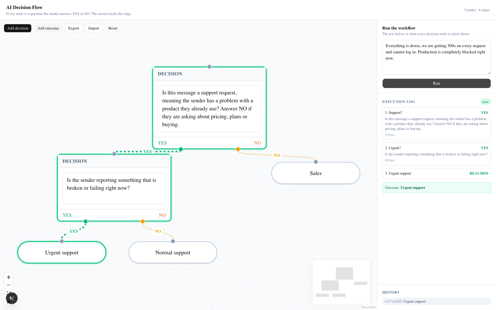

# AI Decision Flow (FlyRank, Week 7)

A visual workflow builder where every node is a question the model answers YES or NO, and the
answer decides which edge the run follows next. You draw the graph in the browser with React
Flow; Inngest executes it, one step per node.



## Run it

Node 20 or newer, and two terminals. From this `week-07-decision-flow/` folder:

```bash
# terminal 1, the app
npm install
cp .env.example .env.local
npm run dev
```

```bash
# terminal 2, the Inngest Dev Server
npx inngest-cli@latest dev -u http://localhost:3000/api/inngest
```

The canvas is at http://localhost:3000, the Inngest dashboard at http://localhost:8288.

Decisions run on a local Ollama by default, so there is no account, no key and no card:

```bash
ollama serve
ollama pull gemma3:4b
```

The tests need none of that:

```bash
npm test
```

## The stack

| Piece | What it does |
| --- | --- |
| Next.js 16 (App Router) | the page and the API routes |
| React Flow (`@xyflow/react`) | the canvas, the nodes, the edges |
| Inngest | runs the workflow, one step per node, with retries |
| OpenAI SDK | talks to the model, pointed at Ollama by default |
| shadcn/ui and Tailwind | the panel and the controls |

Three environment variables move it to a hosted model and nothing else changes:

```bash
LLM_BASE_URL=http://localhost:11434/v1   # or https://api.openai.com/v1
LLM_API_KEY=ollama                       # or sk-...
LLM_MODEL=gemma3:4b                      # or gpt-4o-mini
```

## How a run works

1. `POST /api/run` takes the graph and the input text, validates both, creates a run id and
   sends a `flow/run.requested` event. It answers `202` in about a tenth of a second and does no
   model work itself.
2. The Inngest function finds the start node, the one nothing points at, and walks the graph.
   **Each node is its own `step.run`**, so each decision is retried and memoised on its own and a
   decision already taken is never asked twice.
3. Each decision sends its prompt and the input to the model and reads the reply strictly. The
   branch picks the edge, the edge picks the next node, and reaching an outcome ends the run.
4. The browser polls `GET /api/runs/{id}` and lights up the path as it is taken.

The model is told to answer with one word, and the reply is parsed rather than trusted:

```ts
export function parseAnswer(raw: string): Branch {
  const text = raw.trim().toUpperCase();
  const yes = /\bYES\b/.test(text);
  const no = /\bNO\b/.test(text);
  if (yes && !no) return "yes";
  if (no && !yes) return "no";
  throw new Error(`the model did not answer YES or NO, it said: ...`);
}
```

"Yes and no, it depends" is a failure, not a coin flip. So is "Maybe", an empty reply, and a
refusal. The word boundaries matter too: "eyes" is not a YES.

## Proof: one graph, three inputs, three paths

The same five-node graph, three different customer messages, run through the real endpoint:

```
  Sales            Support?:NO -> Sales
  Normal support   Support?:YES -> Urgent?:NO -> Normal support
  Urgent support   Support?:YES -> Urgent?:YES -> Urgent support
```

and in the Inngest dashboard, one step per decision node:

```
run-workflow           COMPLETED     1435ms  attempts=0
    step 'decide-d1-1'          RUN    COMPLETED  752ms
    step 'decide-d2-2'          RUN    COMPLETED  675ms
```

The one-hop run has one step, the two-hop runs have two. Traversal is dynamic: nothing about the
path is decided until the model answers.

## What I got wrong, and it was the prompt

The first version of the entry node asked, simply, **"Is this message a support request?"** A
pricing enquiry came back YES and routed to support. The machinery was fine and the question was
not, which I confirmed by asking the model both versions directly:

```
"YES"  <- Is this message a support request?
"NO"   <- Is this message a support request, meaning the sender has a problem with a
          product they already use? Answer NO if they are asking about pricing...
```

Then the sharpened version over-corrected: a how-to question with the words "everything is
working fine" in it also came back NO, because a small local model reads that phrase as
"not a problem". The input was as ambiguous as the prompt had been.

The node prompt is the specification. A vague question gets a confident wrong answer, and
tightening it to fix one case can break another, which is why the log panel shows the prompt
next to the answer for every step: when a run goes somewhere surprising, the question that sent
it there is on screen.

## Polish (phase 4)

Five of the listed options, not the minimum three:

**Visual execution state.** Decision nodes turn green or amber for the branch they took, the
reached outcome is ringed, and untaken paths fade back.

**Animated active edges.** The edges the run actually walked animate and thicken. Everything
else drops to 35% opacity, so the path taken reads at a glance.

**Execution logs panel.** Every step in order with its prompt, its answer, its duration and any
error, then the final outcome.

**Execution history.** The last twelve runs by id and outcome, each one clickable to replay its
path onto the canvas.

**Error handling.** Every failure is caught, stored on the run and shown, rather than leaving the
canvas spinning.

Save and load, and JSON export and import, came earlier in phase 2: the graph is written to
`localStorage` on every change and survives a reload, and an imported file is validated before it
is allowed onto the canvas.

## The failure paths, each one run

| What happens | What you get |
| --- | --- |
| a node with an empty prompt | run `failed`, `node d1 has no prompt` |
| the model answers YES but there is no YES edge | run `failed`, `node d1 has no YES edge` |
| every node has an incoming edge, so there is no start | `400` before any model call |
| no input text | `400 input: required` |
| an unknown run id | `404` |
| the model hedges instead of answering | the step throws, Inngest retries once, then the run fails |
| a graph with a cycle | stops after 25 hops rather than looping |

That last one matters because the canvas will happily let you draw a cycle. Without the cap, a
loop would call a paid model until somebody noticed.

## The tests

`npm test` runs 11 assertions with Node's built-in test runner. No framework, no browser, no
model. They cover the strict answer parsing including the hedge and refusal cases, finding the
start node, detecting a graph that has none, following the right branch, edge decoration, the
serialise and parse round trip, dropping the canvas callbacks before saving, and five ways an
imported file can be malformed.

The model call itself is not unit tested. What matters about it is how a real model behaves on a
real prompt, and a mock would only tell me what I already told it.

## Honest limitations

**Runs live in memory.** The API routes and the Inngest function share a module in one Next.js
process, so a restart forgets every run. The job itself is durable because Inngest holds it; the
record of what happened is not. A real version puts runs in Postgres, which the A2 and A3
assignments already covered.

**One input for the whole graph.** Every node is asked about the same text. A more useful version
would let a node act on what earlier nodes decided, rather than re-reading the same message.
